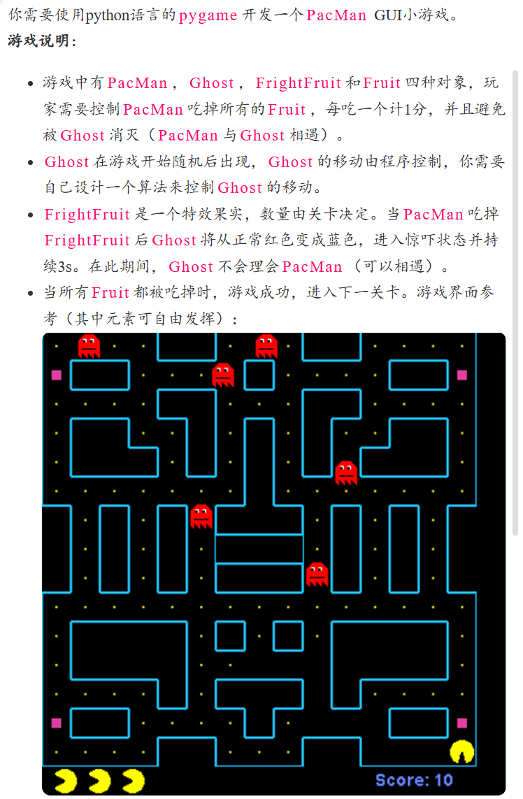

# PacMan 吃豆人小游戏 - Python Pygame 实现

一款基于 Python Pygame 开发的经典吃豆人GUI小游戏，完整还原了经典吃豆人的核心玩法，包含双关卡设计、幽灵AI、特效果实、分数与生命值系统，是Python游戏开发的完整实践项目。

## 项目说明


## 功能特性
- ✅ 经典吃豆人核心玩法：操控吃豆人吃掉所有豆子通关，躲避幽灵的追击
- ✅ 双关卡设计：通关第一关后自动进入第二关，地图难度升级
- ✅ 流畅的角色动画：吃豆人四方向移动帧动画、幽灵常态/惊吓状态双动画
- ✅ 智能幽灵AI：幽灵具备基础追踪能力，会根据玩家位置调整移动方向
- ✅ 惊吓果实机制：吃掉特效果实后，幽灵进入3秒惊吓状态，不再对玩家造成伤害
- ✅ 完整的游戏系统：分数统计、3条生命值、受击无敌帧、关卡重置、胜利/失败判定
- ✅ 精致的迷宫渲染：带圆角的墙体描边，还原经典吃豆人的视觉风格

## 游戏玩法说明
1. **核心目标**：操控吃豆人吃掉地图中所有的黄色豆子，即可通关当前关卡，全部关卡通关则游戏胜利
2. **操作方式**：
   - 方向键 `↑ ↓ ← →` 控制吃豆人的移动方向
   - `ESC` 键退出游戏
3. **游戏规则**：
   - 每吃掉1个普通豆子，得1分
   - 每吃掉1个惊吓果实，得2分，同时所有幽灵进入3秒惊吓状态（蓝色），此阶段幽灵不会对玩家造成伤害
   - 玩家共有3条生命值，碰到常态幽灵会损失1条生命值，生命值归零则游戏结束
   - 受击后玩家会获得1.5秒无敌时间，避免连续掉血

## 环境要求
- Python 3.8 及以上版本
- Pygame 2.5.0 及以上版本

## 安装与运行
### 1. 克隆项目
```bash
git clone https://github.com/你的用户名/你的仓库名.git
cd 你的仓库名
```
### 2.安装依赖
```bash
git clone https://github.com/你的用户名/你的仓库名.git
cd 你的仓库名
```
### 3. 运行游戏
```bash
git clone https://github.com/你的用户名/你的仓库名.git
cd 你的仓库名
```
## 项目结构
```plaintext
PacMan-Game/
├── images/             # 游戏贴图资源文件夹
│   ├── PacMan系列贴图
│   ├── Ghost系列贴图
│   └── FrightFruit.png
├── game.py             # 游戏核心逻辑：角色、碰撞、地图、渲染等所有核心类与方法
├── main.py             # 游戏入口文件，初始化并启动游戏
├── requirements.txt    # 项目依赖声明
├── .gitignore          # Git忽略文件配置
└── README.md           # 项目说明文档
```
### 技术实现亮点

1.流畅的转向控制：实现了预输入转向机制，玩家提前按下方向键，走到可转向位置时自动转向，解决了格子游戏的转向卡顿问题
2.分层渲染优化：迷宫墙体预渲染到 Surface，避免每一帧重复绘制，提升游戏运行性能
3.精准的碰撞检测：实现了圆形碰撞检测、墙体碰撞检测，兼顾了游戏手感与判定精准度
4.模块化代码设计：采用面向对象编程，将吃豆人、幽灵、资源管理、游戏主逻辑拆分为独立的类，代码可读性高、易扩展
5.帧动画控制系统：实现了基于时间的帧动画管理，不同角色独立的动画帧率控制，动画过渡流畅

### 许可证
本项目采用 MIT 许可证，详见 [LICENSE](LICENSE) 文件。


### 说明
本项目为 Python 课程期末大作业，完整实现了经典吃豆人游戏的核心玩法与扩展功能，适合 Python 游戏开发入门学习参考。


